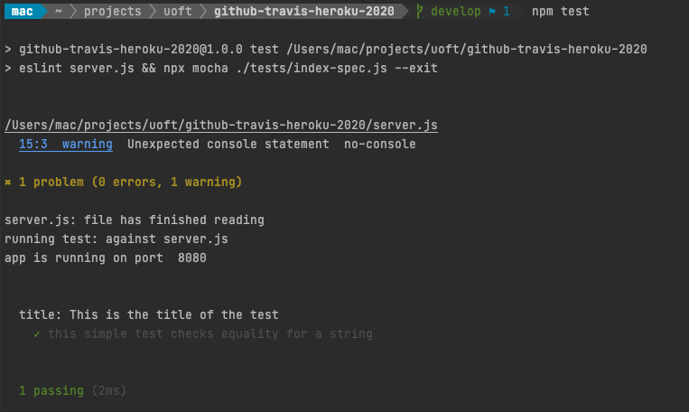
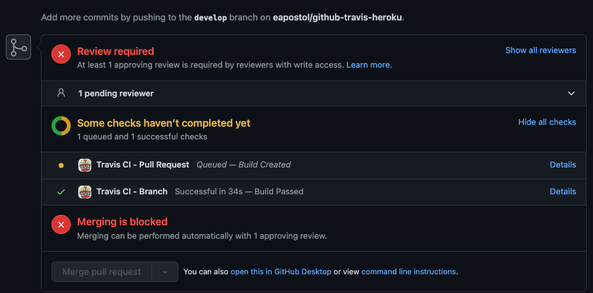
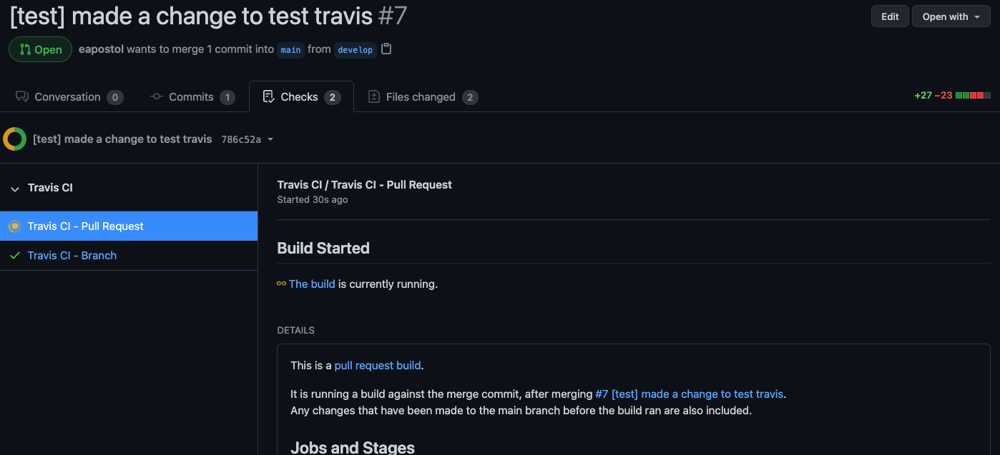
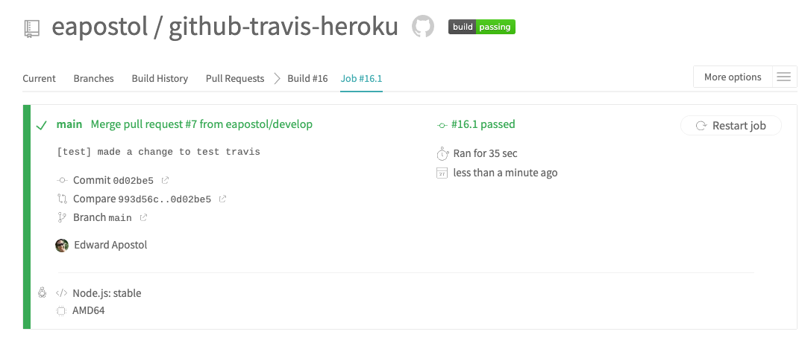
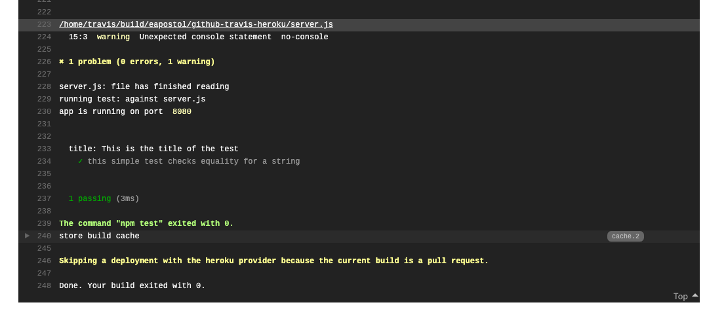

# Tutorial: Using Unit Testing, ESLint, Github with Travis and Heroku for CI/CD
## January 2020


**This Document may be out of date and reviewed occasionally. Please reach out to Edward Apostol if you have any questions.**

Setting up the infrastructure for Continuous Integration (CI) and Continuous Deployment/Delivery (CD_ takes some time, but is well worth the time that would be save from running tests and doing the deployment of your application.

Travis is a CI (Continuous) service which automates the testing, builds the application and deploys the application to a given destination


This sample repository demonstrates the following:

* Syntax Checking using Eslint
* Unit testing with Mocha / Chai
* Using Github for Version Control
* Using Travis for Continuous Integration / Continuous Delivery (CI/CD)
* Using Heroku with Travis for Continuous Deployment (CD)

Notice that CI tools like Travis are _not_ the same as software products like GULP or SASS. (You can look them up to see what they do)

In this activity we will

1. Set up the project repo with Travis CI
2. Ensure that linting passes on all commits before they can be merged into master
3. Ensure that all unit tests pass before they can be merged to master

It is recommended that before you actually apply the test instructions to your project repo, that you _practice_ by **forking** this repository first and testing against your fork.


A typical workflow with Travis, Github and Heroku goes like this:

* A commit is pushed to GitHub

* Travis build is triggered and it checks if the test is passing or failing.

* If all tests pass, then Travis will proceed with pushing to Heroku.

You will ultimately implement these steps to automate both building and unit testing processes.


## Requirements
* The sample code from this repository (or your existing Repository)
* Node JS  (currently tested against 14.x or higher)
* NPM / NPX 6.x

## Node Libraries used
* Dotenv
* Mocha
* Chai
* Express
* ESLint
* ESlint Plugin Support
* ESLint AirBnB Support


## Installation and Setup

### Respository Setup and Package.json installation

1. **Fork this repository** to your account .If you are applying this to your existing repo, have your repo ready.
2. If you are **protecting your master or main branch** you will need to remember to *perform and approve pull requests* to your master or main branch. Travis will detect changes in your master or main branch in order to perform the automation deployment. To protect your main / master branch, visit this [article](https://amachreeowanate.medium.com/how-to-protect-the-master-branch-on-github-ab85e9b6b03#:~:text=Getting%20Started.%201%201.%20Create%20a%20GitHub%20Repository.,Master%20Branch.%204%204.%20Commit%20to%20Master.%20) for details

3. **If you forked the sample repository** run the following

`npm install`

which installs the following from package.json

```
  "dependencies": {
    "chai": "^4.2.0",
    "dotenv": "^8.2.0",
    "express": "^4.17.1",
    "mocha": "^8.2.1"
  },
  "devDependencies": {
    "eslint": "^7.18.0",
    "eslint-config-airbnb-base": "^14.2.1",
    "eslint-plugin-import": "^2.22.1"
  },
  
```
If you are **modifying your existing project**,  minimally add

* Your testing framework (we use mocha / chai here)
* The eslint dependencies and dev dependencies (look at the package.json snippet above)
* dotenv (if you have not used it in your project already) to add to your project.


You can search the [npm website](https://www.npm.js) to find out detailed descriptions of these libraries.

### Connect Your Github Repository to Heroku

Follow the instructions in the [HerokuGuide.pdf](HerokuGuide.pdf) to connect your github account to Heroku and perform an initial *manual* test deployment to Heroku.

This entails:

* Creating a Heroku account if you have not done so
* Installing the Heroku CLI
* Using the Heroku CLI to deployment.

Confirm that you can

* Make make succesful commits (via pull requests if required) to main/master branch, then
* Use the heroku CLI to upload contents to your "dyno" (server) upon Heroku. **Don't forget to note the URL of your Heroku website**.
* Understand the basic application - launch server.js file using `node server.js` (see [server.js](./server.js) source code


### Setup Travis Account and Associate it with your Github Repository

1. [EDIT] Navigate to [https://www.travis-ci.com](https://www.travis-ci.com) (formerly [https://travis-ci.org](https://travis-ci.org) ) and create an account on Travis, associating your *github account* associated with your repository with your Travis account.
2. You can automatically associate *all your existing (and future) github repositories* with Travis (that makes it easy) or select repositories to be managed with Travis. Up to you.

### Install the Github Plugin for Travis

* Navigate to <https://github.com/marketplace/travis-ci>. or go to Github Marketplace and search for the travis plugin for Github

* Select the option to "Set up a new plan" and choose the $0 "Open Source" plan when prompted.

* Click "Install it for free" and then on the next page click "Complete order and begin installation".

* On the next page select the radio button that reads "Only select repositories".

* From the "Select repositories" dropdown, choose your project repo.

* Click the "Install" button to complete the process

### Installing the Travis CLI

Assuming you installed the Heroku CLI, already logged in and did a test deployment to Heroku, you will now implement the automation process with Travis CLI.

#### Installing Ruby

Prior to installing the Travis CLI, you will require RUBY to be installed onto your system. Ruby is a dynamic, open source programming language with a focus on simplicity and productivity.

#####Ruby on Mac
Mac users - you already have a version of Ruby installed. At the terminal, type in `ruby --version` and confirm that it is version 2.6.x or higher.

#####Ruby on Windows

Windows users - If you don't have Ruby already installed onto your system (test it at the terminal with `ruby --version` - no version number,) install the latest 2.x version of Ruby from https://www.rubyinstaller.org. Use the dev kit installer version.


#### Travis CLI

You can follow the instructions to install the Travis CLI at the following link:

https://github.com/travis-ci/travis.rb#installation

You may need to install the Travis CLI with administrator permissions,
whether you are a MAC user or a WIN user.

#####Travis CLI on Mac

You can follow the instructions from the link above. Basically,

`gem install travis --no-document --user-install`

or (if you need admin permissions to install - you will know you need admin permissions if you get a permissions error while installing Travis)

`sudo su ` then enter your mac password, then

`gem install travis --no-document --user-install`

then `exit` if there are no errors.

 or if you have [Homebrew](https://brew.sh/) installed it may be easier to install Travis CLI with Homebrew `brew install travis`.

Alternatively follow the instructions at the link above ( [https://github.com/travis-ci/travis.rb#installation](https://github.com/travis-ci/travis.rb#installation) ) . Note you may need to be `sudo` or have administrative privileges.

**Note about Path Settings**: Your Operating System (Win or Mac) may need to know tjhe location of where the Ruby GEMS are installed.. This directory is similar to node_modules, except for Ruby.

For Mac or Windows, you will need to make sure that Ruby GEMS is added
to your PATH environment variable


For Mac Users:

You can configure it by editing the .bash_profile or .zprofile settings for your terminal, depending on which shell you are using.

```
# If you use bash
echo 'export PATH=/usr/local/Cellar/ruby/2.4.1_1/bin:$PATH' >> ~/.bash_profile 

# If you use ZSH:
echo 'export PATH=/usr/local/Cellar/ruby/2.4.1_1/bin:$PATH' >> ~/.zprofile
```

More information can be found in this article "I INSTALLED GEMS WITH --user-install AND THEIR COMMANDS ARE
NOT AVAILABLE" at https://guides.rubygems.org/faqs/

For Windows Users:

when using the Ruby Installer, if asked for checking 'Add Ruby
executables to your path' then CHECK THAT OPTION. in fact, check all
the options (Install TCL/TK Support and associate .rb and .rbw files with the the ruby install)

Then you can try `gem install travis` ; this installation step should be good, and if not, ensure that you are logged inan
_administrator_ for your machine, and additionally _launch your terminal or git bash
shell_ as an administrator.

additional sources:
* [https://stackify.com/install-ruby-on-windows-everything-you-need-to-get-going/](https://stackify.com/install-ruby-on-windows-everything-you-need-to-get-going/)


Once the Travis CLI is installed (Mac or Windows) confirm that it is runnable from your terminal window by entering

```
travis version
```

It should return the version number.


### Configuring and Testing ESLint to Explore Syntax Checing Tests

ESlint will perform your Syntax tests. If you are using this sample repository, then ESlint is configured for your project after `npm install` , and it contains a sample unit test.

If you are applying it to your own project, then you will have to add the dev dependencies to your project as seen below. (in package.json)

```
"devDependencies": {
    "eslint": "^7.18.0",
    "eslint-config-airbnb-base": "^14.2.1",
    "eslint-plugin-import": "^2.22.1"
  },
```

and create your own unit tests (the sample code uses [Mocha](https://mochajs.org) and [Chai](https://www.chaijs.com), but you can use a different assertion library like [Jasmine](https://jasmine.github.io).)

Install Mocha and Eslint globally to make it available at the terminal

```
npm install -g mocha && npm install -g eslint
```

If you are using the sample project, then there is a sample .eslintignore and .eslintrc.json for you. the .eslintignore tells eslint what files _not to syntax check_ and .eslintrc.json informs the linter what rules to follow (the air bnb rules, and a specific ecmascript version).

If you want to recreate the ESLint related files, run

```
eslint --init
```

and answer the questions accordingly:


(choose yes for the last option as well)

#### Test ESLint and Mocha at the terminal

Note in our sample package.json the following `test` key

```
  "scripts": {
    "test": "eslint server.js && npx mocha ./tests/index-spec.js --exit"
  },
```

if you type in `npm test` in the root directory of your project folder, it should run an eslint syntax check against server.js and then run a fake test based on the test code created in index-spec.js

Note what ESLint returns and make any syntax corrections as needed when you run `npm test`


### Enabling Continuous Integration

You  create a new file called _.travis.yml_ file, which instructs Travis on the build process. The sample project with this repo already has a sample _.travis.yml_ file you could use.

Be aware that the yaml files are _space sensitive_. Improper indentation may result in the yaml file not reading properly. You can look up online yaml validator and test your yaml file to ensure its spaces are set up correctly.

If you use the sample .travis.yml file provided, you will need to adjust

* The heroku API key,
* The name of the app (that is deployed on heroku, which you should have copied above), and
* The name of the repo that is associated for travis deployment.

As we configure the .yml file with travis CLI, your sample file will be overwritten and updated with the correct values.

the .travis.yml sample file

```
language: node_js
node_js:
- stable
npm: true
cache:
  directories:
  - node_modules
deploy:
  provider: heroku
  api_key:
    secure: {PUT_YOUR_OWN_API_KEY_HERE}
  app: {the name of your deployed heroku app}
  on:
    repo: {your github profile name/name of repo here}
```

The language option can be whatever language your app is running in and the "node_js": "stable" indicates Travis should use a stable version of node as it builds your app.

You can also cache your **node_modules** directory on Travis to avoid installing all dependencies every time a build is triggered
and have Travis tell Node/NPM to updates packages that have newer versions when deploying.

#### Configure Github, Heroku and Travis to work together

Before you start:


##### Create a Github Token

Ensure that you have created a github token associated with your account. Follow the directions here if you have not made one before: [https://docs.github.com/en/github/authenticating-to-github/creating-a-personal-access-token](https://docs.github.com/en/github/authenticating-to-github/creating-a-personal-access-token). You can call it "Travis Token for Github" . It allows Travis to access your Github account from the terminal. For Permissions, You can check off most of the settings except delete repo, user related management, and enterprise repo management options.


1. Return to your main or master branch for your repository if you are not there already.
2. Confirm you are logged into Heroku with `heroku login`
3. Now user the travis CLI to login into Travis using `travis login
   --com --github-token {token key here}` (note it used to be `travis
   login --org`). You now require a github token to login with.
4. After you have logged in with Travis, type `travis setup heroku` (or
   `travis setup heroku --force` if you wish to update the sample
   .travis.yml file that is part of the sample repo and replace it with
   updated settings)
5. If you have protected your main/master branch, go back to your develop branch, make a change, commit and push that change. Otherwise make a code change while in main/master that will by default be successful to test (i.e. add a comment in code, add, commit and push your change to main/master).
6. Run `npm test` and make any changes or corrections to the syntax as ESLint will inform you. As ane example, in the screen below, line 15, column 3 has a warning. it's a `console.log()` statement. use the [ESlint API documentation](https://eslint.org/docs/2.13.1/user-guide/configuring#disabling-rules-with-inline-comments) to determine how to either accept or disable console.log() from being checked.



Add, commit, and push your changes as needed.

7. If you cannot merge your branch's changes directly (i.e. you are in develop or another branch), use the pull request process to do code reviews and accept your change from your develop branch to the main / master branch.
8. Also note the changes to the Gihub Pull Request process if you need to merge your develop branch into main/master/. You may see that Travis is enabled to generate a build and run tests as it is being approved during a pull request.




The image above shows Github running Travis during the pull request.



The image above shows the information that is revealed when you click on 'details'. It just indicates that you can review the information of the build process from Github itself _in addition to_ looking at the Travis Dashboard.


At the same time, make sure you have your Travis dashboard displayed to show the status of the build and investigate the _task runners_ that are being executed.







This is the view from the Travis Task Runner in the dashboard. It noted the same warning in the previous image. You can fix it in a subequent add, commit and push cycle.

9. At This point, if Travis is reporting 'success' you should be able to visit your deployed website on Heroku and see any updated content (of course, you won't see any console.log statements from nodejs, but if you changed some visual content it would be reflected)


CONCLUSION: When future commits and are pushed and approved, merging to main/master, then Travis takes over and runs the tests, creates the build, and deploys the site to Heroku. If tests fail on the way, you can explore the output either in Github or Travis, and make changes, and add / commit / push / create a pull request / merge and the deployment is done automatically.


